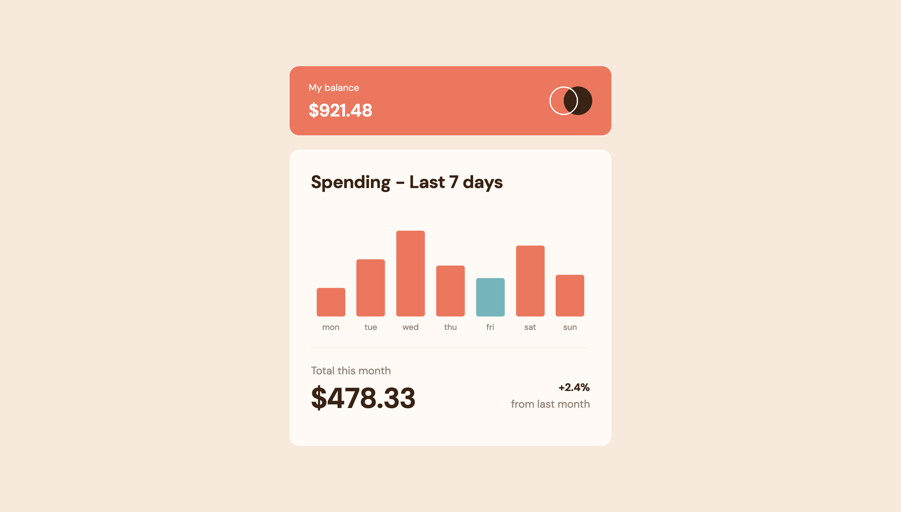
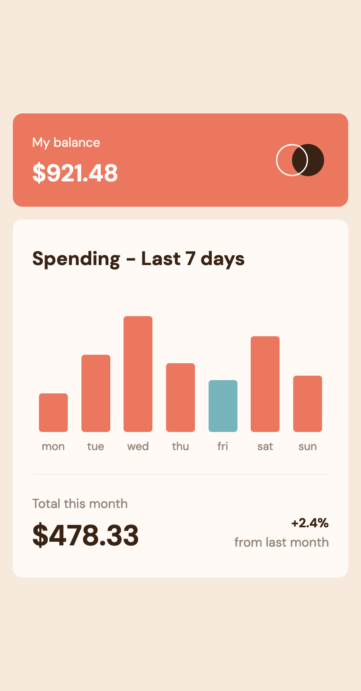

# Frontend Mentor - Expenses chart component solution

This is a solution to the [Expenses chart component challenge on Frontend Mentor](https://www.frontendmentor.io/challenges/expenses-chart-component-e7yJBUdjwt). Frontend Mentor challenges help you improve your coding skills by building realistic projects.

## Table of contents

- [Overview](#overview)
  - [The challenge](#the-challenge)
  - [Screenshots](#screenshots)
  - [Links](#links)
- [Built with](#built-with)

## Overview

### The challenge

Users should be able to:

- View the bar chart and hover over the individual bars to see the correct amounts for each day
- See the current day’s bar highlighted in a different colour to the other bars
- View the optimal layout for the content depending on their device’s screen size
- See hover states for all interactive elements on the page
- **Bonus**: Use the JSON data file provided to dynamically size the bars on the chart

### Screenshots

### Links

- Solution URL: [github.com/stay-js/fm-expenses-chart](https://github.com/stay-js/fm-expenses-chart)
- Live Site URL: [fm-expenses-chart.znagy.hu](https://fm-expenses-chart.znagy.hu)

## Built with

- **Deployment**: [Netlify](https://www.netlify.com)
- [Astro](https://astro.build)
- [Tailwind CSS](https://tailwindcss.com)
